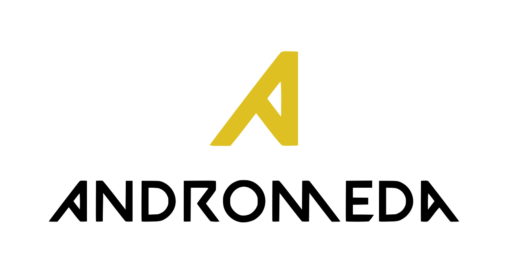

<h1 align="center">

  

</h1>

[About](#About)&nbsp;&nbsp;&nbsp;|&nbsp;&nbsp;&nbsp;[Installation](#Installation-)&nbsp;&nbsp;&nbsp;|&nbsp;&nbsp;&nbsp;[Features](#Features)&nbsp;&nbsp;&nbsp;|&nbsp;&nbsp;&nbsp;[Wiki][wiki]&nbsp;&nbsp;&nbsp;|&nbsp;&nbsp;&nbsp;[Release][release]&nbsp;&nbsp;&nbsp;|&nbsp;&nbsp;&nbsp;[Contributing](CONTRIBUTING.md)&nbsp;&nbsp;&nbsp;|&nbsp;&nbsp;&nbsp;[Codeowners](CODEOWNERS)&nbsp;&nbsp;&nbsp;|&nbsp;&nbsp;&nbsp;[Code of Conduct](CODE_OF_CONDUCT.md)&nbsp;&nbsp;&nbsp;|&nbsp;&nbsp;&nbsp;[Security](SECURITY.md)&nbsp;&nbsp;&nbsp;|&nbsp;&nbsp;&nbsp;[License](LICENSE)

 
# Contents

- [Contents](#contents)
- [About](#about)
- [Features](#features)
  - [Implemented](#implemented)
  - [Unimplemented](#unimplemented)
- [Installation ](#installation-)
    - [*Andromeda* **build** with Bazel](#andromeda-build-with-bazel)
    - [*Andromeda* **test** build with Bazel](#andromeda-test-build-with-bazel)
  - [Linux](#linux)
    - [Archlinux](#archlinux)
- [License ](#license-)

# About

<table>
<tr>
<td>
  A C++ MMORPG game engine seed built with Raytracing, Vulkan, P2P networking, and blockchain member verification in mind. Heavy focus on efficiency, extensibility, clarity, and portability.
</td>
</tr>
</table>

# Features

## Implemented

<ul>
<li>Instance</li>
</ul>

## Unimplemented

<ul>
<li>Window Abstraction</li>
</ul>

# Installation 

*Andromeda* is currently only available from source via [Bazel][bazel-build] (v 4.1.0) for multi-platform compilation and scaling. It targets a static library which can then be included to create *Andromeda* instances. The build is configurable with the following flags:
<table>
<tr>
<td>
  Required flags:

  - `--config=(debug|release)`
      - `debug` builds an unoptimized release with all relevant debugging information.
      - `release` builds an optimized release with no debugging information.
  
</td>
</tr>
<tr>
<td>
  Optional flags:

  - `--config=graphics:<API>` compiles the rendering engine with the specified API backend. More than one API can be enabled, but generally only one is needed. If `--graphics` is omitted, it will default to `vulkan`. *Andromeda* was built with [Vulkan][vulkan] in mind, which offers the best performance, feature suite, and portability; and generally should not be substituted. ***Currently, the only API available is Vulkan.***
  
  - `--config=santizer:<Santizer>` compiles [Google Santizers][santizers] with the static library. This option may overwrite other options on the build. The `Santizer` can be any of `asan`, `msan`, `ubsan`, or `tsan`. If `--config=sanitizer` is omitted, no santizers will compiled.
  
  - `--config=log:<Level>` optionally enables `Andromeda::Logging` at compile-time, which logs core and instance information at a specified level. The `Level` can be any of `none`, `trace`, `debug`, `info`, `warn`, `error`, or `critical`. The `Level` may be adjusted explicitly at runtime. If `--log` is omitted, it will default to `none`.

  - `--config=assert:<Level>` optional enables `Andromeda::Logging` assertions at compile time, which logs core and instance assertions at a specified level. The `Level` can be any of `none` or `all`. If `--assert` is omitted, it wil default to `none`.

</td>
</tr>
</table>

### *Andromeda* **build** with [Bazel][bazel-build]

- `bazel build '...' --config=(debug|release) --config=graphics:(vulkan) --config=sanitizer:(asan|msan|ubsan|tsan) --config=log:(none|trace|debug|info|warn|error|critical) --config=assert:(none|all)`

The library will built in `bazel-bin/andromeda`. You can manually link your project, or include this project as a [Bazel][bazel-build] dependency.

You may also test the current implementation for any configuration:

### *Andromeda* **test** build with [Bazel][bazel-build]

- `bazel test '...' -config=(debug|release) --config=graphics:(vulkan) --config=sanitizer:(asan|msan|ubsan|tsan) --config=log:(none|trace|debug|info|warn|error|critical) --config=assert:(none|all)`

The latest test evaluation on common configurations is continuously integrated, statically analyzed, and built on [Github][github] actions.

Refer to the platform specific instructions if necessary. Additional information provided in the <a href="https://github.com/robbie-vanderzee/andromeda/wiki">Wiki</a>.

## Linux
### Archlinux

*Andromeda* requires library linking with both the Window server library [GLFW][glfw] and a Graphics API ([Vulkan][vulkan]) as these are not built from source.

<table>
<tr>
<td>

Installing [GLFW][glfw]:

`pacman` can install GLFW on the core repository:

- `sudo pacman -S glfw-wayland`
- `doas pacman -S glfw-wayland`

</td>
</tr>
<tr>
<td>

*Andromeda's* implementation of GLFW ***runs with [Wayland][wayland]***. The `X-server` implementation is deprecated.

Installing [Vulkan][vulkan]:

Obtaining Vulkan depends on your graphics card manufacturer, as Vulkan implementations are shipped with the Drivers.

 * The [Vulkan Archwiki][archwiki-vulkan] outlines more specific installation instructions and information.

</td>
</tr>
</table>

# License 

[MIT](LICENSE) © Robbie VanDerzee

  Built with :heart: by Robbie VanDerzee

<!--
Website References
-->
[bazel-build]:https://github.com/bazelbuild/bazel
[github]:https://github.com/robbie-vanderzee/andromeda/actions
[vulkan]:https://www.khronos.org/vulkan/
[glfw]:https://www.glfw.org/
[wayland]:https://wiki.archlinux.org/index.php/Wayland
[santizers]:https://github.com/google/sanitizers

<!--
Wiki references
-->
[archwiki-vulkan]:https://wiki.archlinux.org/index.php/Vulkan

<!--
Link References
-->
[release]:https://github.com/robbie-vanderzee/andromeda/releases/ "Latest Release (external link) ➶"
[wiki]:https://github.com/robbie-vanderzee/andromeda/wiki "Wiki (external link) ➶"

[badge-license]:https://img.shields.io/github/license/robbie-vanderzee/andromeda?color=blue&style=for-the-badge
[badge-stars]:https://img.shields.io/github/stars/robbie-vanderzee/andromeda?style=for-the-badge
[badge-archlinux]:https://img.shields.io/badge/-Archlinux-blue?style=for-the-badge&logo=arch-linux&logoColor=white